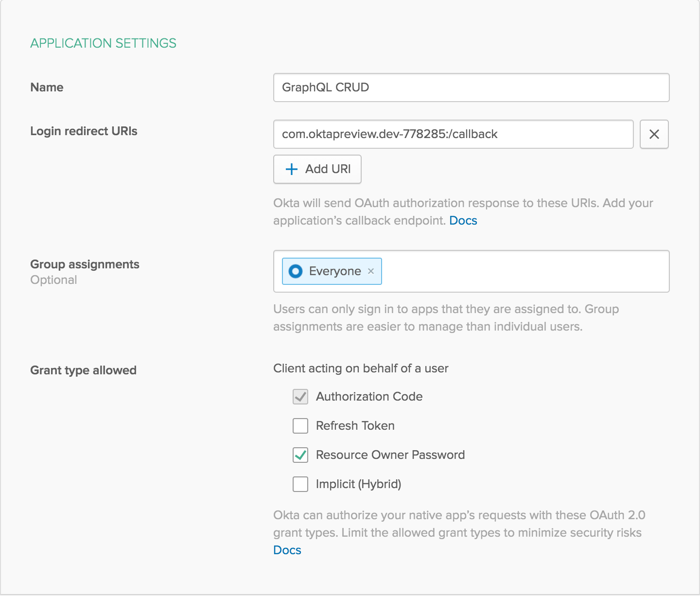

# Example CRUD App with Node.js and GraphQL

This is an example API, showing how to create a GraphQL endpoint in Node. The mutations are protected behind authentication provided by Okta.

**Prerequisites**: [Node.js](https://nodejs.org/en/).

## Getting Started

To install this example application, run the following commands:

```bash
git clone git@github.com:oktadeveloper/okta-node-graphql-crud-example.git
cd okta-express-graphql-example
npm install
```

This will install a local copy of the project. You will need to set up some environment variables before the app will run properly.

To integrate Okta's Identity Platform for user authentication, you'll first need to:

* [Sign up for a free Okta Developer account](https://www.okta.com/developer/signup/)
* You will get a URL similar to `https://dev-123456.oktapreview.com`.
  * Save this URL for later
  * You will also use this URL to login to your Okta account

You will need to create an application in Okta:

* Log in to your Okta account, then navigate to **Applications** and click the **Add Application** button
* Select **Native** and click **Next**
* Give your application a name (e.g. "GraphQL Express")
* Check the box for **Resource Owner Password**, then click **Done**

Your Okta application should have settings similar to the following:



After creating the application, click **Edit** in the **Client Credentials** section. Change the **Client authentication** to **Use Client Authentication**. This will generate a client secret. Save both the **Client ID** and **Clinet Secret** for later.

You will also need to create an API token in Okta:

* Log in to your Okta account, then navigate to **API > Tokens** and click the **Create Token** button
* Enter a name that will help you remember what this is used for (e.g. "GraphQL Express")
* Save the provided **token value** for later
  * This will only be displayed once. If you lose it, you will need to create another API token

Now create a file called `.env` in the project root and add the following variables, replacing the values with your own from the previous steps.

**.env**
```bash
OKTA_ORG_URL=https://{yourOktaOrgUrl}
OKTA_CLIENT_ID={yourClientId}
OKTA_CLIENT_SECRET={yourClientSecret}
OKTA_TOKEN={yourOktaToken}
```

Now you can run the GraphQL server with the following command:

```bash
npm start
```

## Usage

Once you're up and running, you can get a nice user interface with built-in documentation by going to <http://localhost:4000>. Queries shouldn't require authentication, but if you want to run a mutation you'll need to authenticate first.

#### Authenticating

In the playground, run the `login` mutation using your Okta credentials, which would look something like this:

```graphql
mutation {
  login(username: "myusername@example.com", password: "hunter2") {
    token
  }
}
```

If you provide the right username and password, you'll get an access token that will look something like `eyJraW...j5gsJQ`, only much longer.

In the GraphQL Playground, click on `HTTP HEADERS`, then modify it to include an `authorization` header with your token. It should look like this:

```json
{
  "authorization": "Bearer eyJraW...j5gsJQ"
}
```

**Note**: Again, the real token will be much longer. Just copy and paste it from the mutation response.

#### Example Queries

Here are some examples to get you started. Feel free to play around with them and get creative.

##### Get all quotes

```graphql
query {
  quotes {
    id
    phrase
    quotee
  }
}
```

##### Add a new quote

```graphql
mutation {
  addQuote(phrase: "That is so shway!", quotee: "Nora West-Allen") {
    id
  }
}
```

##### Update a quote

```graphql
mutation {
  editQuote(id: "4ef19b4b-0348-45a5-9a9f-6f68ca9a62e6", quotee: "XS") {
    id
    phrase
    quotee
  }
}
```

##### Delete a quote

```graphql
mutation {
  deleteQuote(id: "4ef19b4b-0348-45a5-9a9f-6f68ca9a62e6") {
    ok
  }
}
```

## Links

This example uses the [Okta Node SDK](https://github.com/okta/okta-sdk-nodejs) and the [Okta JWT Verifier](https://github.com/okta/okta-oidc-js/tree/master/packages/jwt-verifier).

## Help

Please [raise an issue](https://github.com/oktadeveloper/okta-node-graphql-crud-example/issues) if you find a problem with the example application, or visit our [Okta Developer Forums](https://devforum.okta.com/). You can also email [developers@okta.com](mailto:developers@okta.com) if would like to create a support ticket.

## License

Apache 2.0, see [LICENSE](LICENSE).
